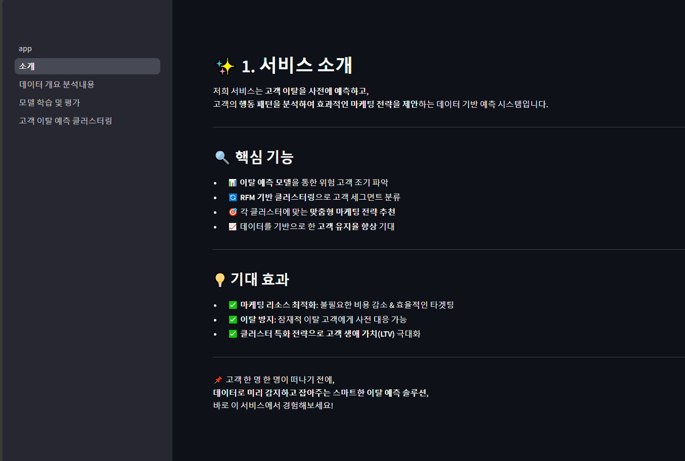
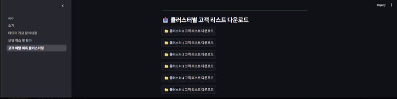

# 🛒 E-Commerce Customer Churn Prediction

> **SK FAMILY AI 캠프 14기 팀 프로젝트 (2025.06.04 ~ 2025.06.05)**  
> 담당 역할: 머신러닝 모델링, 성능 평가, 최종 모델 선정, Streamlit UI 구현, Gemini API 연동

---

## 📌 프로젝트 개요

이커머스 고객의 다양한 행동 데이터를 분석하여 **이탈 가능성 높은 고객을 예측**하고,  
고객을 **클러스터링하여 맞춤형 마케팅 전략을 수립**하는 프로젝트입니다.

- 다양한 ML 모델 성능 비교 및 최적 Threshold 조정
- RFM 기반 K-Means 클러스터링
- Google Gemini API를 통한 자동 마케팅 전략 생성
- Streamlit을 통한 웹 기반 서비스 구현

---

## 🧑‍💻 주요 기여 내용

| 항목 | 상세 |
|------|------|
| ✅ 머신러닝 | 8가지 모델 비교, GradientBoostingClassifier 최종 선정 |
| ✅ Threshold 튜닝 | 기본 임계값(0.5) → **0.134 최적화**로 Recall 1.0 달성 |
| ✅ Streamlit | 전체 페이지 설계 및 구현 (탭 구성, 예측 출력, 시각화) |
| ✅ Gemini API | 클러스터별 특성 기반 **자동 마케팅 전략 생성 기능 연동** |
| ✅ 모델 저장 및 배포 | `joblib` 모델 저장 → 예측에 활용 가능하도록 통합 |

---

## 📊 데이터 요약

- 총 11,000+ 고객 데이터
- Target: 고객 이탈 여부 (`Churn`)
- 주요 Feature: `OrderCount`, `HourSpendOnApp`, `SatisfactionScore`, `DaySinceLastOrder`, `Tenure` 등

---

## ⚙️ 모델 성능 (최종 선정 모델: Gradient Boosting + Threshold=0.134)

| 지표 | 값 |
|------|----|
| Accuracy | 0.9938 |
| Recall (Class 1) | **1.0000** |
| F1-score | 0.9938 |

> **Recall(재현율)**을 높이기 위해 예측 확률 기반 Threshold를 세밀하게 조정

---

## 🔍 RFM 기반 고객 세그먼트 분석

**KMeans(6개 군집) + RFM 지표**로 고객을 나누고,  
각 클러스터별로 페르소나 정의 및 마케팅 전략 도출

| 클러스터명 | 특성 | 전략 |
|------------|------|-------|
| 핵심 로열 고객 | 구매 빈도 ↑, 소비 ↑ | 로열티 프로그램 강화 |
| 단발성 고가 고객 | 1~2회 고액 구매 | VIP 리마케팅 |
| 이탈 고위험군 | 최근 활동 O, 구매↓ | 긴급 할인/알림 |
| 장기 비활성 | 활동 없음 | 리타겟팅, 리마인드 |
| 기타 | 중간 활동 고객 등 | 유지 중심 메시징 |

---

## 🤖 Gemini API 연동

Google Gemini Pro를 활용하여,  
클러스터별 평균 특성(RFM + 이탈 확률 등)을 기반으로  
**AI가 자동으로 마케팅 전략 문장을 생성**하도록 연동

---

## 🖥️ Streamlit 결과 화면

| 화면 | 설명 |
|------|------|
| 홈 대시보드 | 프로젝트 개요 요약 |
| EDA 시각화 | 이탈 패턴 분석 그래프 |
| 모델 학습 | 모델 비교 및 최종 성능 출력 |
| 이탈 예측 | 예측 확률 + 결과 시각화 |
| 마케팅 전략 | Gemini 생성 결과 표시 |

---

## 🛠️ 스스로 개선한 내용

| 개선 항목 | 설명 |
|-----------|------|
| 📌 Threshold 최적화 | 클래스 불균형 문제에 대응해 직접 예측 확률 기준 재조정 |
| 📌 모델 평가 방식 정교화 | Precision-Recall tradeoff 고려한 지표 설정 |
| 📌 시각화 디자인 개선 | 주요 그래프별 인사이트 강조 문구 추가 |
| 📌 코드 리팩토링 | 예측 함수 및 API 호출 함수 구조화 |

---

## 💬 한 줄 회고

> 머신러닝 모델을 직접 학습시키고 Streamlit으로 구현하면서,  
> 데이터를 **실제 서비스 형태로 연결**해 본 첫 프로젝트였습니다.  
> 특히 Gemini API 연동으로 실시간 전략 생성을 실현한 점이 인상 깊었습니다.

---

## 🔗 참고

- 원본 팀 프로젝트: [SKN14-2nd-3Team Repository](https://github.com/yourteam-repo)
- 개인 포트폴리오 정리용 (본 저장소)
